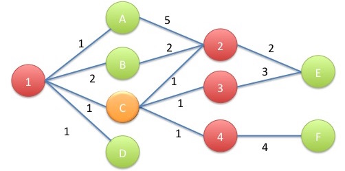
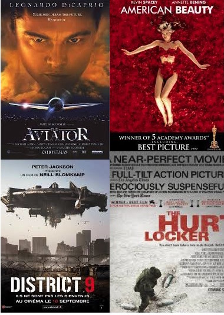
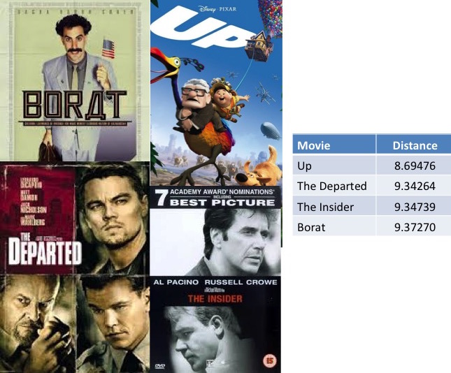
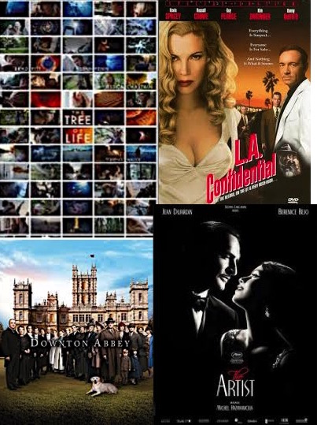
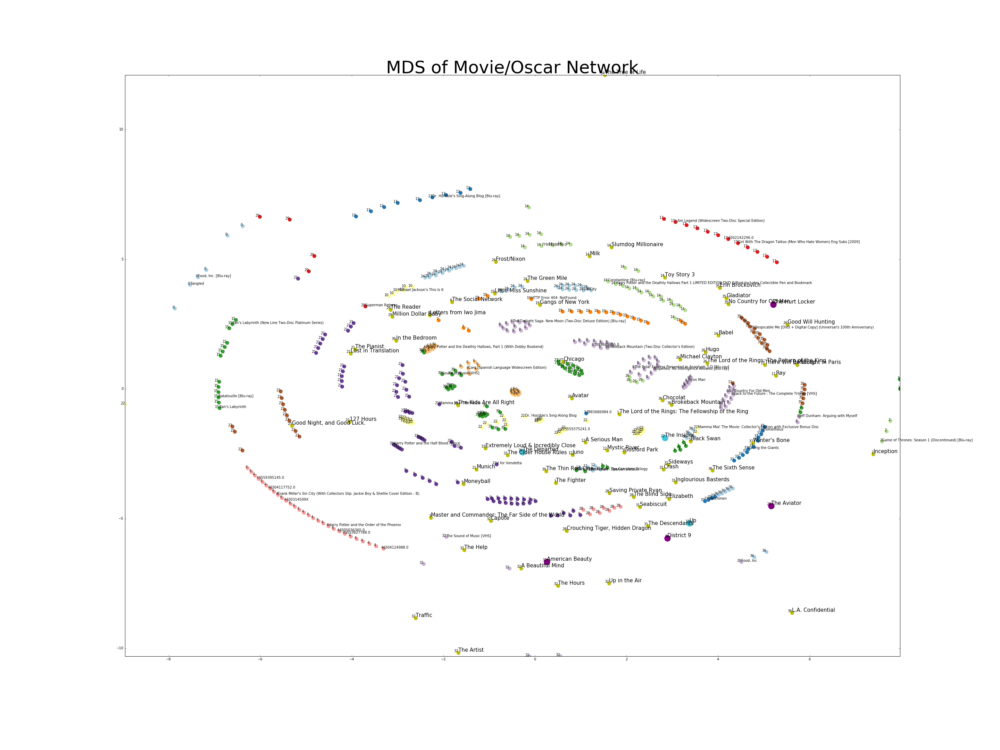
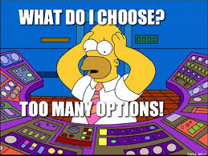

<div><center> <h1 style="font-size:50px; color: #a94442;">Welcome to the 89th Academy Awards!</h1> 
<h3 style="margin-bottom: 25px; color: #B19D30;">Using Amazon Movie Reviews to Analyze Oscar Nominations for Best Picture</h3> </center>
<center><h4 style="font-weight:normal">Bob Minnich, Ziyue Jin, Rong Wang, Aoyuan Liao, Josh Dillon</h3></center>
<center><h4 style="font-weight:normal; margin-bottom: 40px;">April 12, 2016</h4></center></div>

<i><h2 style="font-size:25px;">Overview</h2></i>
For our project, BRIEF OVERVIEW OF PROJECT HERE.

<i><h2 style="font-size:25px;">Movie Graph Theory</h2></i>
Graph theory was used in order to determine distances between Users, Movies and Oscars. Graph theory offers a nice way to try and relationships between users and movies. Below is an example of how to use graph theory using Amazon reviews:
<div style="text-align: center;">
 <span style="float:center;width: 200px;">
   
 </span>
</div>
From this graph we now have a metric that we can use between all pairwise nodes within a graph. For instance we can now find similar users within a graph, by closest distance and similar movies within the same way.

<i><h2 style="font-size:25px;">Rating Adjustment and Calculation</h2></i>
Give brief explanation of work here.

<i><h2 style="font-size:25px;">Subesetting the Amazon Review Database</h2></i>
In order to focus on a specific area of the Amazon Movie Review dataset we decided to focus on the most popular populations of the Users (Top 100 Reviewers - Number of Reviews), Movies (Top 500 Movies Reviewed - Number of Reviews)

<div style="text-align: center;">
 <span style="float:center;width: 200px;">
   
 </span>
</div>
<i><h2 style="font-size:25px;">Movies Seen by a Reviewer</h2></i>
As an example of our graph what we will do is choose the user with the smallest number of reviewed movies. In this case on of the top reviewers had reviewed only 4 of the 498 movies within our dataset. 

This user had seen the following movies:
<div style="text-align: center;">
 <span style="float:center;width: 200px;">
   
 </span>
</div>

<i><h2 style="font-size:25px;">Recommended Movies Based on Network Distance</h2></i>
From our network we can look up a user, and find the distances between that user, and all other nodes. By filtering out the user nodes, and looking at the closest movies we get the following reccomendations for our user.

<div style="text-align: center;">
 <span style="float:center;width: 200px;">
   
 </span>
</div>


<i><h2 style="font-size:25px;">Farther Movies from User Based on Network Distance</h2></i>
We can also look at the movies that are farthest away from our user or the movies that we would least likely suggest.


<div style="text-align: center;">
 <span style="float:center;width: 200px;">
   
 </span>
</div>

<i><h2 style="font-size:25px;">Network Visualization</h2></i>
Having pairwise distances avialable between all users, MDS or Multidimensional Scaling, is a good cnadidate to try and understand potential clustering between groups and try to visualize the complex graph on a 2D plane.

The scatter plot below was created using MDS with 2 components. After this distance matrix was created, K-Means Clustering was performed with a Gaussian Mixture Model using 40 components to try and identify sub populations within the data.

We can see from the plot below that there are many groupings within the MDS transformation. After further investigation there are many duplicates that appear in our data including the many different versions of medium for viewing a movie. This makes sense that they woud close to eachother because in the Amazon Movie review database, almost all of them have the same reviews from the same reviewers. 

Points that are larger, and in gold are Oscar movies, with other movies that are colored by their grouping that was produced using the Gaussian Mixture Model. Labels of each point has it's group number and a title if available.

Points that are larger in purple, are the movies that our user mentioned previously has viewed and the larger points in light blue, are the recommended movies. It might not be as insightful on suggesting reviews, becasue the dimension has been reduced but we can see that Up is very close to Disctrict 9 and the Aviator that our user has already viewed. It does become apparent that the movies that are the farthest from our user are some of the farthest within the plot below

<div style="text-align: center;">
 <span style="float:center;width: 200px;">
   
 </span>
</div>

<i><h2 style="font-size:25px;">Logistic Regression Model to Predict Oscar Winners</h2></i>
As part of our analysis, we were curious if it would be possible to predict the winner of Best Picture based on information gathered through Amazon movie reviews. We began by joining the Amazon data with our Oscars data, which included variables such as whether or not they won Best Picture, and what year they were nominated in.
After, we also joined the data with movie scores given by Twitter. Then we split into training and testing data.

This predictive model is most likely biased as we had to use reviews posted before and after the Oscar nomination and ceremony dates to have a large enough sample size.


```r
#################### Load Libraries ##################

library(dplyr)
library(data.table)
library(caret)

#################### Prepare Data ####################
movies <- read.csv("movies2.csv", stringsAsFactors=FALSE)
oscar_asin <- read.csv("project4-team-5/data/oscar_nominations.csv", stringsAsFactors=FALSE)
oscar_dates <- read.csv("project4-team-5/data/oscar_dates.csv", stringsAsFactors=FALSE)
twitter_data <- read.csv("project4-team-5/data/oscar_winners_FINAL_twitter2.csv", stringsAsFactors=FALSE)
twitter_data[14,]$Title = "Crouching Tiger, Hidden Dragon"
twitter_data$Year<-NULL
twitter_data$Win<-NULL
twitter_data$ASIN<-NULL
twitter_data<-twitter_data[1:98,]

# Take first genre
for(i in 1:length(twitter_data$Genre)){
  twitter_data$Genre[i]<-strsplit(twitter_data$Genre[i], "|", fixed=TRUE)[[1]][1]
}

oscar_movies <- left_join(oscar_asin, movies, by = c("ASIN" = "product_productid"))
final_data <- subset(left_join(oscar_movies, twitter_data, by = c("Title" = "Title")), select=c(3,8,15,16))

# Split into training and testing data
train<-sample_frac(final_data, 0.7)
sid<-as.numeric(rownames(train))
test<-final_data[-sid,]
```

Creating the logistic regression model was fairly easy. We chose to go with this model as it works well with categorical data, in our case, whether or not a movie wins Best Picture after being nominated.


```r
# Fit logistic regression model
fit <- glm(Win~Score+factor(Genre)+review_score,data=train,family=binomial(link='logit'))
fit.result <- predict(fit, test)
fit.result <- ifelse(fit.result > 0.5,1,0)
error <- mean(fit.result != test$Win)

# Percent correctly classified
print(paste0('Percent classified correctly ', (1-error) * 100, "%"))
summary(fit)

# Statistically significant variables
summary(fit)$coeff[-1,4] < 0.05
```

Our model fits very well, with an average of 81% accuracy in correctly choosing which nominated movies would win Best Picture. In addition, we analyzed the variables within the model to determine statistically significance. Interestingly, the Amazon movie review score was not deemed statistically significant, while the Twitter score and main genre were significant.


<i><h2 style="font-size:25px;">Shiny App</h2></i>
Based on the distance matrix we got from the network, we build a recommendation engine for oscar movies.

Imagine this scenario...

<i><h3 style="font-size:20px;color: #9ACD32;">You wanna watch a movie but have no idea what movie to see. </h3></i>

<i><h3 style="font-size:20px;color: #9ACD32;">You want to see an Oscar movie but there are so many movies that have won the Oscars. </h3></i>

<i><h3 style="font-size:20px;color: #9ACD32;">You want a movie with a specific genre but don't wanna waste time on a stinker.<br> <br></h3></i>

<div style="text-align: center;">
 <span style="float:center;width: 200px;">
   
 </span>
</div>
<br> <br>
<div style="text-align: left;">
 <span style="float:center;width: 200px;">
   
 </span>
</div>
<h1 style="text-align: center;">https://crimeradar.shinyapps.io/Recsys/</h1>

How do we recommend?


##D3


```r
cat('
<script>
  d3.select("body").append("p").text("d3 made me")
</script>
')
```


<script>
  d3.select("body").append("p").text("d3 made me")
</script>

<script>

var width = 960,
    height = 500;
    radius = 10;

var color = d3.scale.category20();

var force = d3.layout.force()
    .charge(-50)
    .linkDistance(100)
    .size([width, height]);

var svg = d3.select("body").append("svg")
    .attr("width", width)
    .attr("height", height);

var drag = force.drag()
    .on("dragstart", dragstart);
var xScale = d3.scale.linear()
                     .domain([1, 75])
                     .range([0.1, 0.2]);

var nodes
var graph
var links
var noders
var linkers
// ABH4G7TVI6G2T
d3.json("data.json2", function(error, graph) {
  //if (error) throw error;

  force
      .nodes(graph.nodes)
      .links(graph.links)
       .alpha(0)
      .start();
  d3.selec
  link = svg.selectAll(".link")
      .data(graph.links)
    .enter().append("line")
      .attr("class", "link")
      .style("stroke-width", 0.1);

   node = svg.selectAll(".node")
      .data(graph.nodes)
    .enter().append("circle")
      .attr("class", "node")
      .attr("type", function(d) { return d.desc;})
      .attr("name", function(d) { return d.id;})
      .attr("neigh", function(d) { return +d.neigh;})

      .attr("r",function(d) { 
            if(d.id == "The Aviator" ){return 7;}
            if(d.id == "American Beauty" ){return 7;}
            if(d.id == "District 9" ){return 7;}
            if(d.id == "The Hurt Locker" ){return 7;}
            if(d.id == "Up" ){return 7;}
            if(d.id == "The Departed" ){return 7;}
            if(d.id == "The Insider" ){return 7;}
            if(d.id == "Borat" ){return 7;}
            if(d.id == "B004FM2ENU" ){return 7;}
            else if (+d.neigh == 1){return 7;} 
            if(d.id == "B004FM2ENU" ){return 10;}

            if (d.desc == "movies") {return 5;} 
            else {return 4;}}) 
      .style("fill", function(d) { 
        //AV6QDP8Q0ONK4
            if(d.id == "The Aviator" ){return "#800080";}
            if(d.id == "American Beauty" ){return "#800080";}
            if(d.id == "District 9" ){return "#800080";}
            if(d.id == "The Hurt Locker" ){return "#800080";}
            if(d.id == "Up" ){return "#43C6DB";}
            if(d.id == "The Departed" ){return "#43C6DB";}
            if(d.id == "The Insider" ){return "#43C6DB";}
            if(d.id == "Borat" ){return "#43C6DB";}
            if(d.id == "Borat" ){return "#43C6DB";}

            if(d.id == "B004FM2ENU" ){return "orange";}
            if(d.id == "A1J2931UBBJPXM" ){return "blue";}
            else if (+d.neigh == 1){return "#B8860B";} 
            else if (+d.neigh == 57){return "black";} 

            else if (d.desc == "movies") {return "green";} 
            else if (d.desc == "oscar") {return "#FFD700";} 
            else {return "red";}})
      .on("dblclick", dblclick)
      .call(drag);

    node.append("title")
      .attr("dx", ".10em")
      .attr("dy",  ".10em")
      .text(function(d) {return d.name; });

  // node.append("title")
  //     .text(function(d) { return d.id; });
var noders = svg.selectAll(".node"),
    linkers = svg.selectAll(".link");

  svg.selectAll("circle")
        .on("mouseover", function(){ output = d3.select(this)[0][0].attributes.name
          output2 = d3.select(this)[0][0].attributes.neigh.value
          svg.append("text")
          .attr("x", (width*8/ 10))             
          .attr("y", 20)
          .attr("text-anchor", "middle")  
          .style("font-size", "12px") 
          .style("text-decoration", "underline")  
          .text(output.value + "  " + output2);
          })
        .on("mouseout", function(){svg.selectAll("text").remove();})

        //     

  force.on("tick", function() {
    link.attr("x1", function(d) { return d.source.x; })
        .attr("y1", function(d) { return d.source.y; })
        .attr("x2", function(d) { return d.target.x; })
        .attr("y2", function(d) { return d.target.y; });
    node.attr("cx", function(d) { return d.x; })
        .attr("cy", function(d) { return d.y; });
    // node.attr("cx", function(d) { return d.x = Math.max(radius, Math.min(width - radius, d.x)); })
    //     .attr("cy", function(d) { return d.y = Math.max(radius, Math.min(height - radius, d.y)); });
    // node.attr("cx", function(d) { return 300; })
    //     .attr("cy", function(d) { return 400; });
  });
});
var output
function dblclick(d) {
  d3.select(this).classed("fixed", d.fixed = false);
}

function dragstart(d) {
  d3.select(this).classed("fixed", d.fixed = true);
}
</script>


